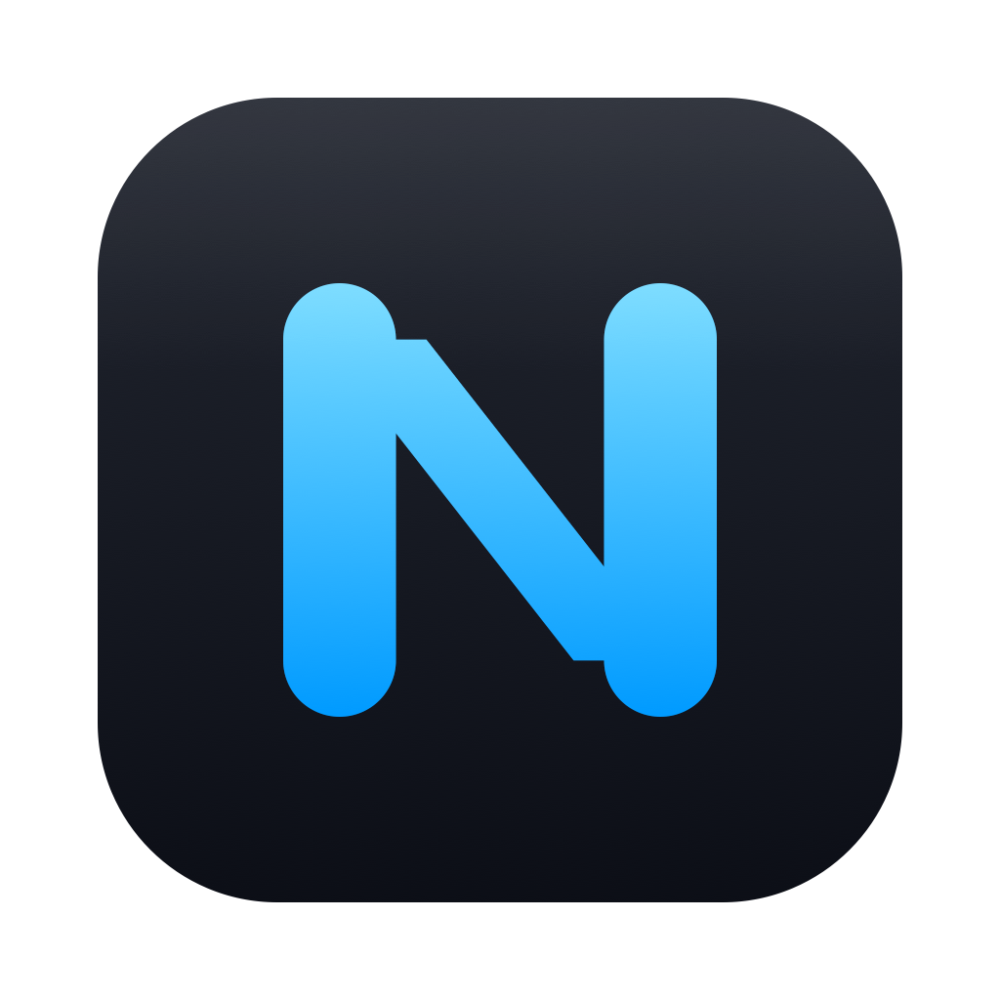
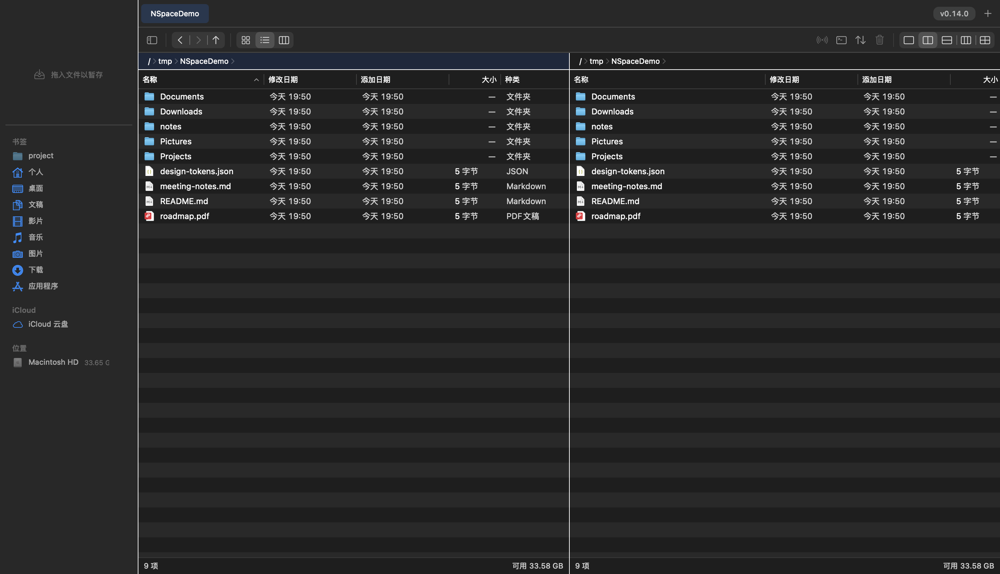

<p align="center">
  
</p>

<h1 align="center">NSpace</h1>

<p align="center">
  为 macOS 打造的原生多窗格文件管理器 —— <b>QSpace 的功能，Finder 的原生性，谁都没有的性能</b>
</p>

<p align="center">
  <a href="https://github.com/SammySnake-d/NSpace/releases/latest"></a>
  
  
  <a href="LICENSE"></a>
</p>



## 为什么做 NSpace

Finder 信息密度太低；QSpace Pro 在新系统上卡顿、闲置 CPU 居高不下。NSpace 用纯 AppKit 从零实现 QSpace 级的多窗格工作流，并把性能当成硬指标：**北极星验收 = 四窗格常驻侦听下闲置 CPU 0.0%**（FSEvents 直接子级过滤 + 后台窗格全挂起，每次发版实测）。

## 功能

- **多窗格布局**：单栏 / 双列 / 双行 / 三列 / 四宫格（⌃⌘1..5），窗格间 F5 复制 / F6 移动
- **工作区标签**：标签对象是整个分屏布局（⌘T / ⌘W / ⌘1..9 直达，MRU 关闭回退），会话完整恢复
- **自绘顶部甲板**：工作区标签条 + 图标工具条，与全高侧栏一线贯通（Finder 式穿透观感）
- **暂存架**：文件拖入牌堆暂存，跨目录批量复制 / 移动 / AirDrop（hover 浮出操作条）
- **聚焦搜索**：⌘F 当前目录 / ⇧⌘F 全局；名称 + 内容 + 种类过滤；**独有隐藏文件搜索通道**（Spotlight 之外自建扫描，超越 QSpace）
- **文件操作内核**：copyfile 克隆加速、字节级进度、冲突裁决（替换/跳过/两者保留/合并）、撤销、操作回执
- **归档**：压缩 zip / tar.gz（可加密）、解压 20+ 格式、包裹文件夹语义
- **接管「打开文件位置」**：第三方 App 的 Reveal 请求落 NSpace 并选中目标（与 QSpace 同机制，可开关）
- **全局呼出/隐藏热键**：任意 App 一键置顶 / 隐藏（无需辅助功能权限）
- **热更新**：内置更新器对接 GitHub Releases，自动下载就绪、重启即完成
- 快捷键全部可配（注册表 + 录制器）、列可选可排序、Space 预览、双击走系统默认程序、深浅色随系统

## 安装

从 [Releases](https://github.com/SammySnake-d/NSpace/releases/latest) 下载 `NSpace-vX.Y.Z.zip`，解压拖入「应用程序」。

> 发行包为 ad-hoc 签名（无 Apple 开发者证书）：首次打开请**右键 → 打开**，或执行
> `xattr -dr com.apple.quarantine /Applications/NSpace.app`。应用内热更新自动处理隔离标记，后续升级无需重复。

## 从源码构建

只需 Xcode Command Line Tools（无需完整 Xcode）：

```bash
git clone https://github.com/SammySnake-d/NSpace.git && cd NSpace
./scripts/build-app.sh     # 构建并签名 build/NSpace.app
./scripts/test.sh          # 15 个测试套件
./scripts/ui-smoke.sh      # 81 项 UI 真效果断言（免录屏权限自渲染截图）
```

## 架构

按[可组合执行元架构](https://github.com/SammySnake-d/NSpace/blob/main/META_COMPLIANCE.json)组织：能力全部封装为**物理胶囊（pods）**——`Contract.swift` 是唯一公共面，经构造注入组合，展示层禁用写型文件 API（BG-1，pre-commit 机械执法）：

```
Sources/
├─ NSpaceContracts/   共享词汇表（FileItem/OperationSpec/RunState…）
├─ NSpaceKernel/      操作内核：Run 状态机 + 冲突裁决 + 进度流（唯一状态提交者）
├─ Pods/              DirectoryReader · Transfer · LocalOps · ArchiveEngine · DirectoryWatch
│                     BookmarkStore · StashStore · SessionStore · SearchEngine · FolderSize
│                     IconThumb · VolumeInfo · PathComplete · UpdateEngine
└─ NSpaceApp/         AppKit 展示层（纯代码 UI，语义色 Token，4pt 网格 grid-lint 执法）
```

设计系统见 [DESIGN.md](DESIGN.md)；工程门禁（meta-doctor / pod-lint / grid-lint / 测试）全部挂 pre-commit，绿灯才允许提交。

## 已知系统边界（诚实说明）

- macOS 26+ 在系统层锁定「文件夹默认程序」为 Finder——任何 App（含 QSpace）都无法接管普通"打开文件夹"请求（五组实验实证）。NSpace 提供的等价通道：Reveal 接管、Finder 右键服务「用 NSpace 打开」、`nspace://open?path=`、全局热键。
- 已在别处运行的 App 需重启一次才会读到 Reveal 接管（系统全局偏好按进程缓存）。

## License

[MIT](LICENSE)
